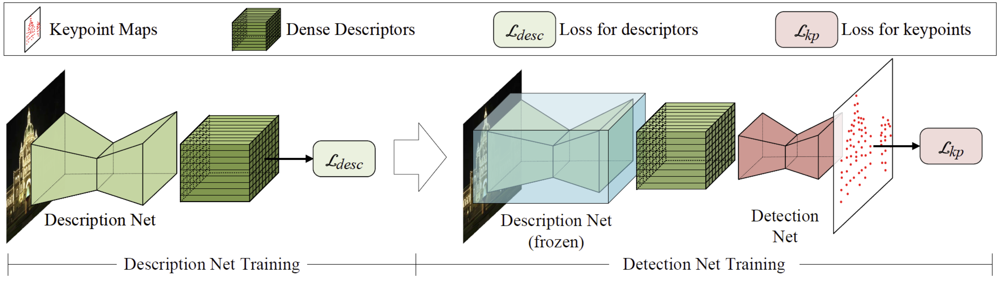
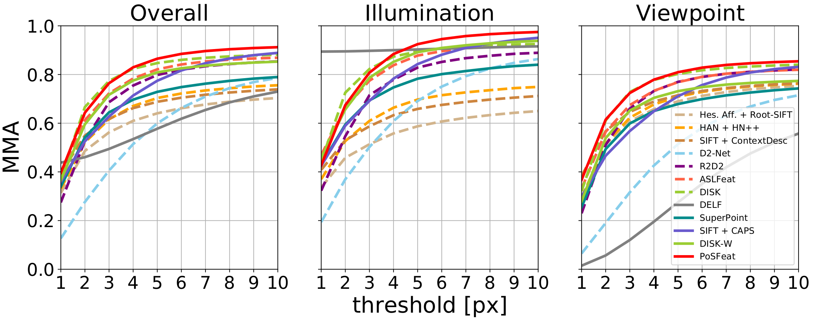

# Decoupling Makes Weakly Supervised Local Feature Better (PoSFeat)
This is the official implementation of **PoSFeat** (CVPR2022), a weakly supervised local feature training framework.

**Decoupling Makes Weakly Supervised Local Feature Better** <br>
[Kunhong Li](https://scholar.google.co.uk/citations?user=_kzDdx8AAAAJ&hl=zh-CN&oi=ao), [Longguang Wang](https://longguangwang.github.io/), [Li Liu](http://lilyliliu.com/Default.aspx), [Qing Ran](https://scholar.google.co.uk/citations?user=6ydy5oEAAAAJ&hl=zh-CN&oi=ao), [Kai Xu](http://kevinkaixu.net/index.html), [Yulan Guo* ](http://yulanguo.me/)<br>
**[[Paper](https://openaccess.thecvf.com/content/CVPR2022/html/Li_Decoupling_Makes_Weakly_Supervised_Local_Feature_Better_CVPR_2022_paper.html)] [[Arxiv](https://arxiv.org/abs/2201.02861)] [[Blog](https://zhuanlan.zhihu.com/p/477818450)] [[Bilibili](https://www.bilibili.com/video/BV1xg411R7wD?spm_id_from=333.337.search-card.all.click)] [[Youtube](https://www.youtube.com/watch?v=VnjdkAOIndc)]** 

## Overview
We decoupled the description net training and detection net training, and postpone the detection net training. This simple but effective framework allows us to detect robust keypoints based on the optimized descriptors.
<p align="center"> </p>

## Training
**(1) Download training data**

下载[CAPS](https://github.com/qianqianwang68/caps)处理好的MegaDepth子集。注意，如果要参加[IMC](https://www.cs.ubc.ca/research/image-matching-challenge/current/)，需要手动去掉一些场景(`0008 0021 0024 0063 1589`)。

Down the preprocessed subset of MegaDepth from [CAPS](https://github.com/qianqianwang68/caps). If you want to test the local feature on [IMC](https://www.cs.ubc.ca/research/image-matching-challenge/current/), please manually remove the banned scenes (`0008 0021 0024 0063 1589`).
<!-- (<font style="background: #8B0000;" color=white> 0008 0021 0024 0063 1589 </font>). -->

**(2) Train the description net**

开始训练描述子网络之前，首先按照你自己的训练集路径去修改[config/train_desc.yaml](https://github.com/The-Learning-And-Vision-Atelier-LAVA/PoSFeat/blob/main/configs/train_desc.yaml)中`data_config_train`里的`data_path`。

因为某些原因（具体我也不知道为啥QAQ），我们现在使用的多卡训练极其慢，因此要先在终端设置单一GPU可见

To start the description net training, please mannuly modify the `data_path` of `data_config_train` in [config/train_desc.yaml](https://github.com/The-Learning-And-Vision-Atelier-LAVA/PoSFeat/blob/main/configs/train_desc.yaml). 

Because of unknown reason, the multi-gpu training is really slow, so we should set single GPU available
```
export CUDA_VISIBLE_DEVICES=0
```

随后开始跑训练

Then run the following command
```
python train.py --config ./configs/train_desc.yaml
```

描述子网络的训练大概需要24小时（24G显存的3090单卡）

It takes about 24 hours to finish description net training on a single NVIDIA RTX3090 GPU.

**(3) Train the detection net**

修改关键点配置文件中的`datapath`并且在终端设置单一GPU可见

Similarly, modify the `datapath` and set single GPU available
```
export CUDA_VISIBLE_DEVICES=0
```

随后开始跑训练

And run the command
```
python train.py --config ./configs/train_kp.yaml
```

**(4) The difference between the results trained with this code repo and in the paper**

论文里我们用的`SGD`优化器和`lr=1e-3`，这各仓库中是`Adam`和`lr=1e-4`。注意`Adam`在`lr=1e-3`时可能无法收敛。

In the paper, we use `SGD` optimizer with `lr=1e-3` to train the model, and here is the `Adam` with `lr=1e-4`. Note that, Adam with lr=1e-3 may not achieve convergence.

**(5) Multi-GPU training**

我们使用pytorch的`DistributedDataParallel` API来实现单机多卡训练，但不知道为啥特别慢，所以都是禁掉了多GPU的。如果你实在需要多GPU训练，可能得自己修改一下代码，使用`DataParallel` API。

In this code repo, we use the `DistributedDataParallel` API of pytorch to achieve multi-GPU training, which is slow because of unknown reason. If you really need multi-gpu training, please modify the codes to use `DataParallel` API.

**(6) Visualization during training**

我们提供了可视化工具来监控训练进程，尤其是关键点检测训练的过程，损失函数的值是无法作为参考的，因此需要通过关键点得分图的情况来判断是否需要停止训练。可视化的结果包括了关键点得分图，关键点和原始匹配，所有结果都会存在checkpoint的路径中。注意在训练描述子时，可视化用到的关键点时sift（这个时候关键点检测网络还没训呢）。匹配用不同颜色代表了匹配的正确程度（绿色最优），但这个评价是依赖对极几何完成的，不一定完全正确。

We also provide a visualization tool to give an intuition about the model performance during training. The results (including the heatmap, keypoints and raw matches) will be saved in the checkpoint path.
The visualization results includes the scoremap of keypoints (meaningless for description net training), the keypoints (sift for description net training) and matches (we color the match line with epipolar constraint).

**(7) Some dependencies**

其他的依赖库不做赘述，[path](https://path.readthedocs.io/en/latest/index.html)这个包因为有很多重名的所以单独列出来，请根据[readme on github](https://github.com/jaraco/path)或者[introduction on PyPI](https://pypi.org/project/path/)去安装path包。

We depend on the [path](https://path.readthedocs.io/en/latest/index.html) package to manage the paths in this repo, please follow the [readme on github](https://github.com/jaraco/path) or [introduction on PyPI](https://pypi.org/project/path/) to install it. Users may be familiar with other dependencies, you can simply use `pip` and `conda` to install dependencies.

## Evaluation
**(1) Feature extraction**

使用`extract.py`就可以提取PoSFeat特征，这个文件依赖于[managers/extractor.py](https://github.com/The-Learning-And-Vision-Atelier-LAVA/PoSFeat/blob/main/managers/extractor.py)，使用者需要提供一个`.yaml`的配置文件，文件中需要包含datapath和detector config。输出的特征可以用`.npz`或`.h5`两种格式保存。

如果配置文件里`use_sift: True`，那么输出的关键点会使用sift而不是学习的关键点。这里的sift使用的是OpenCV的默认设置，提取过程在dataloader里面完成，直接包含在了inputs字典里。

Using the `extract.py` can extract PoSFeat features. This file works with the [managers/extractor.py](https://github.com/The-Learning-And-Vision-Atelier-LAVA/PoSFeat/blob/main/managers/extractor.py), and users should provide a config file containing the datapath, detector config. The output can be `.npz` or `.h5`.

With `use_sift: True` in the config file, the output would be the sift keypoint with PoSFeat descriptor. The SIFT keypoints are detected with the OpenCV default settings in the dataloader.


**(2) HPatches**

HPatches数据集的测试采用了[D2-Net](https://github.com/mihaidusmanu/d2-net/tree/master/hpatches_sequences)提出的方式。首先需要按照D2-Net介绍的方法取下载和处理数据集。为了方便，我们稍微修改了输入部分的代码，评测部分没有修改。评测的结果会以`.npy`文件的形式保存在[evaluations/hpatches/cache](https://github.com/The-Learning-And-Vision-Atelier-LAVA/PoSFeat/tree/main/evaluations/hpatches/cache)中，这个文件夹里有一些现有方法的结果缓存。注意，一定要按D2-Net的要求去除原始数据集中的一些高分辨率的图像。

We follow the evalutaion protocal proposed by [D2-Net](https://github.com/mihaidusmanu/d2-net/tree/master/hpatches_sequences) (please follow the introduction in D2-Net to download and modify the dataset), and modify the input codes for convenience. The result will be saved in [evaluations/hpatches/cache](https://github.com/The-Learning-And-Vision-Atelier-LAVA/PoSFeat/tree/main/evaluations/hpatches/cache) as a `.npy` file, and we provide the results of several methods in the cache folder. Note that, you should mannuly remove the high resolution scenes in the original dataset.

Run the command
```
export CUDA_VISIBLE_DEVICES=0
python extract.py --config ./configs/extract_hpatches.yaml
```

提取完特征之后，跑评测，先将终端跳到[evaluations/hpatches](https://github.com/The-Learning-And-Vision-Atelier-LAVA/PoSFeat/blob/main/evaluations/hpatches)，修改一下脚本里包含的待评测方法（不改的话，只会有缓存的PoSFeat_CVPR结果）

Then turn to the [evaluations/hpatches](https://github.com/The-Learning-And-Vision-Atelier-LAVA/PoSFeat/blob/main/evaluations/hpatches) folder, modify the path in the evaluation script (if you donnot modify the script, there is only a PoSFeat_CVPR cache result) and run the script
```
cd ./evaluations/hpatches
python evaluation.py
```

完成评测后，[evaluations/hpatches](https://github.com/The-Learning-And-Vision-Atelier-LAVA/PoSFeat/blob/main/evaluations/hpatches)中会有一个包含曲线的图像和一个包含数值结果的`.txt`文件

When finishing the evaluation, you will get pictures of curves and a `.txt` file containing the quantitative results in the [evaluations/hpatches](https://github.com/The-Learning-And-Vision-Atelier-LAVA/PoSFeat/blob/main/evaluations/hpatches) folder.

<p align="center"> </p>

**(3) Aachen-Day-Night**

这部分测试完全按照[The Visual Localization Benchmark](https://www.visuallocalization.net/)中standard Local feature challenge的[pipeline](https://github.com/tsattler/visuallocalizationbenchmark)来进行，因此按照pipeline的介绍，先下载数据集，然后按照以下的结构组织数据集

We follow the standard Local feature challenge [pipeline](https://github.com/tsattler/visuallocalizationbenchmark) of [The Visual Localization Benchmark](https://www.visuallocalization.net/), please follow the introductions to download the dataset, then manage the data in this way
```
data_path_root_aachen
├── 3D-models/
│  ├── aachen_v_1/
│  │  ├── aachen_cvpr2018_db.nvm
│  │  └── database_intrinsics.txt
│  └── aachen_v_1_1/
│     ├── aachen_v_1_1.nvm
│     ├── cameras.bin
│     ├── database_intrinsics_v1_1.txt
│     ├── images.bin
│     ├── points3D.bin
│     └── project.ini
│ 
├── images # the v1 data and v1.1 data are mixed in this folder
│  └── images_upright/
│     ├── db/
│     ├── queries/
│     └── sequences/
│
├── queries/
│  ├── day_time_queries_with_intrinsics.txt
│  ├── night_time_queries_with_intrinsics.txt
│  └── night_time_queries_with_intrinsics_v1_1.txt
│ 
└── others/
   ├── database.db
   ├── database_v1_1.db
   ├── image_pairs_to_match.txt
   └── image_pairs_to_match_v1_1.txt
```

如果不想按照上述结构组织数据集，那么你需要手动的修改一下数据路径的设置（[evauluations/aachen/reconstruct_pipeline.py](https://github.com/The-Learning-And-Vision-Atelier-LAVA/PoSFeat/blob/main/evaluations/aachen/reconstruct_pipeline.py) (Line 329-339) and [evauluations/aachen/reconstruct_pipeline_v1_1.py](https://github.com/The-Learning-And-Vision-Atelier-LAVA/PoSFeat/blob/main/evaluations/aachen/reconstruct_pipeline_v1_1.py) (Line 319-330)）

If you do not want to manage the data, you should mannuly modify the datapath settings in [evauluations/aachen/reconstruct_pipeline.py](https://github.com/The-Learning-And-Vision-Atelier-LAVA/PoSFeat/blob/main/evaluations/aachen/reconstruct_pipeline.py) (Line 329-339) and [evauluations/aachen/reconstruct_pipeline_v1_1.py](https://github.com/The-Learning-And-Vision-Atelier-LAVA/PoSFeat/blob/main/evaluations/aachen/reconstruct_pipeline_v1_1.py) (Line 319-330).

测试之前，还是先提特征

Before evaluation, we should extract the features first,
```
export CUDA_VISIBLE_DEVICES=0
python extract.py --config ./configs/extract_aachen.yaml
```

在aachen-v1上测试，用下列代码

For evaulation on aachen-v1, run the command
```
cd ./evaluations/aachen
python reconstruct_pipeline.py --dataset_path [YOUR_data_path_root_aachen] \
--feature_path ../../ckpts/aachen/PoSFeat_mytrain/desc \
--colmap_path [YOUR_PATH_TO_COLMAP] \
--method_name PoSFeat_mytrain \
--match_list_path image_pairs_to_match.txt
```

在aachen-v1.1上测试，用下列代码

For evaulation on aachen-v1.1, run the command
```
cd ./evaluations/aachen
python reconstruct_pipeline_v1_1.py --dataset_path [YOUR_data_path_root_aachen] \
--feature_path ../../ckpts/aachen/PoSFeat_mytrain/desc \
--colmap_path [YOUR_PATH_TO_COLMAP] \
--method_name PoSFeat_mytrain \
--match_list_path image_pairs_to_match_v1_1.txt
```

测试完成后，数据集路径中会有两个额外的文件夹，`intermedia`里面是一些中间结果（比如database和稀疏点云），`results`里面是可以提交到benchmark的`.txt`文件。

After evaluation, there will be 2 more folders created, `intermedia` contains intermediate results (such as sparse model and database) and `results` contains the `.txt` files that can be upload to the benchmark.


Note that, because the pose estimation (image registration) is based on the results of reconstruction, the results may be different each time.

**(4) ETH local feature benchmark**

按照[ETH local feature benchmark](https://github.com/ahojnnes/local-feature-evaluation) ([download instruction](https://github.com/ahojnnes/local-feature-evaluation/blob/master/INSTRUCTIONS.md))中的介绍下载数据集。数据集需要按照下列方式组织

Download the dataset following the introduction in [ETH local feature benchmark](https://github.com/ahojnnes/local-feature-evaluation) ([download instruction](https://github.com/ahojnnes/local-feature-evaluation/blob/master/INSTRUCTIONS.md)). Manage the dataset in this way
```
data_path_root_ETH_LFB
├── Alamo/
│  ├── images/
│  │  └── ...
│  └── database.db
│ 
├── ArtsQuad_dataset/
│  ├── images/
│  │  └── ...
│  └── database.db
│
├── Fountain/
│  ├── images/
│  │  └── ...
│  └── database.db
│ 
└── ...
```
还是先提特征，我们按不同的场景完成特征提取（手动修改配置文件里的`subfolder`）

Extract features first, we extract features for different scenes individually (mannuly modify the subfolder)
```
export CUDA_VISIBLE_DEVICES=0
python extract.py --config ./configs/extract_ETH.yaml
```
然后对不同场景进行测试

Then run evaluation for the scene
```
cd ./evaluations/ETH_local_feature
python reconstruction_pipeline.py --config ../../configs/extract_ETH.yaml
```

## BibeTeX

If you use this code in your project, please cite the following paper
```
@InProceedings{li2022decoupling,
    title={Decoupling Makes Weakly Supervised Local Feature Better},
    author={Li, Kunhong and Wang, Longguang and Liu, Li and Ran, Qing and Xu, Kai and Guo, Yulan},
    booktitle = {Proceedings of the IEEE/CVF Conference on Computer Vision and Pattern Recognition (CVPR)},
    month     = {June},
    year      = {2022},
    pages     = {15838-15848}
}
```